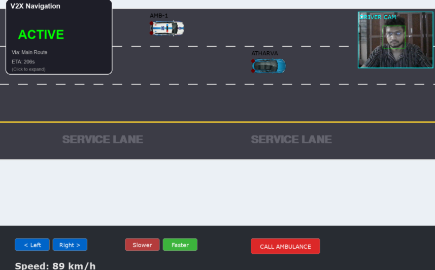
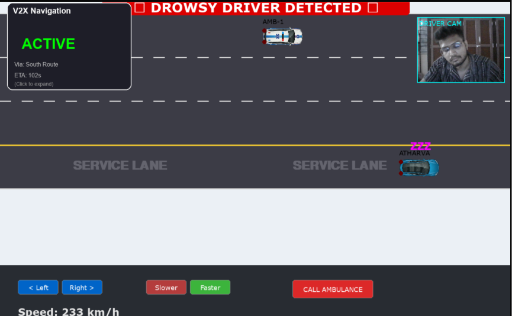

# 🚗⚡ V2X Smart Highway Simulation System

### 🌐 AI + V2X + Computer Vision + Intelligent Transportation Infrastructure

<p align="center">
  
</p>

<p align="center">
  
  
  
  
  
</p>

---

# 🌍 Overview

The **V2X Smart Highway Simulation System** is a real-time connected vehicle ecosystem where multiple computers act as intelligent vehicles communicating over MQTT to form a cooperative smart transportation network.

Each node behaves like a **connected vehicle** and continuously shares:

* 📍 Position
* 🚗 Speed
* 🛣️ Lane Information
* ⚠️ Safety Alerts

All vehicle telemetry is visualized on a live interactive dashboard integrated with AI safety systems, navigation intelligence, and smart infrastructure (V2I).

---

# 🎥 Project Demo (Live Screenshots)

<p align="center">
  
  
  
</p>

<p align="center">
  <sub>📊 Real-Time V2X Dashboard • 🗺️ Navigation System • 😴 Drowsiness Detection & Smart Parking</sub>
</p>

---

# 🚀 Core Innovation

This project simulates a **Vehicle-to-Everything (V2X)** environment combining:

* Distributed vehicle nodes
* Real-time MQTT communication
* AI safety intelligence
* Smart infrastructure (V2I)
* Intelligent navigation & traffic behavior

Unlike basic traffic simulations, this system models a **cooperative connected highway ecosystem**.

---

# 🧠 System Architecture

```
        🚗 Multiple Vehicle Nodes (Computers)
                        │
                        ▼
                  📡 MQTT Broker
                        │
        ┌───────────────┼───────────────┐
        │               │               │
       V2V             V2I       Emergency Alerts
        │               │               │
        └──────────► Real-Time Simulation Engine
                          + AI Safety Layer
                          + Navigation System
                          + Smart Infrastructure
```

---

# 🎯 Key Highlights

⚡ Real-Time V2V Communication using MQTT
🧠 AI-Based Driver Drowsiness Detection (OpenCV)
🚑 Emergency Vehicle Priority Intelligence
🛣️ Bidirectional Smart Highway Simulation
🔦 Adaptive High/Low Beam Headlight System
💡 Smart Street Lighting (Vehicle-to-Infrastructure)
🗺️ Dynamic Navigation with Obstacle Injection
📊 Interactive Real-Time Dashboard Visualization

---

# 🔥 Core Features

## 🚗 V2X Communication System

* Distributed vehicle nodes using MQTT protocol
* Real-time telemetry sharing (speed, lane, position, alerts)
* Multi-computer synchronized simulation
* Cooperative collision avoidance logic

## 😴 AI Driver Drowsiness Detection

* Real-time face detection using OpenCV
* Detects driver inactivity and fatigue
* Automatic service-lane parking when drowsy
* Global safety alert broadcast to nearby vehicles

## 🚑 Emergency Vehicle Intelligence

* One-click ambulance spawning system
* Automatic lane yielding behavior
* Priority traffic logic using V2X alerts
* Real-time emergency broadcasting

## 🛣️ Smart Highway Simulation Engine

* 4-Lane Intelligent Architecture:

  * Lane 0–1 → Forward Traffic
  * Lane 2 → Opposite Traffic
  * Lane 3 → Service Lane (Drowsy Parking)
* Smooth lane change physics
* Collision avoidance with safe-distance logic
* Adaptive braking & speed control

## 🔦 Adaptive Headlight System (India-Focused Innovation)

* Detects oncoming vehicles in opposite lane
* Automatically switches High Beam → Low Beam
* Restores High Beam after vehicles pass
* Reduces night-time glare accidents

## 💡 Intelligent Street Light Infrastructure (V2I)

* Street lights activate 500m ahead of vehicles
* Infrastructure responds dynamically to telemetry
* Energy-efficient smart lighting system
* Demonstrates real Vehicle-to-Infrastructure interaction

## 🗺️ Advanced Navigation & Routing

* Google Maps-style live route visualization
* Dynamic rerouting with obstacle injection
* Real-time ETA calculation
* Full-screen interactive navigation mode

---

# 🧩 Simulation Pipeline

```
Vehicle Sensors & Camera
          ↓
   AI Safety Modules (CV)
          ↓
   Telemetry Broadcasting (MQTT)
          ↓
  Central Simulation Engine
          ↓
Dashboard + Navigation + Infrastructure Response
```

---

# 🛠️ Tech Stack

| Category             | Technology                                  |
| -------------------- | ------------------------------------------- |
| Language             | 🐍 Python 3                                 |
| Simulation Engine    | 🎮 Pygame                                   |
| Numerical Processing | 🔢 NumPy                                    |
| AI & Computer Vision | 🧠 OpenCV (Haar Cascade)                    |
| Networking           | 📡 MQTT (paho-mqtt, EMQX Broker)            |
| System Type          | 🚗 V2X Distributed Architecture             |
| Domain               | 🌐 Intelligent Transportation Systems (ITS) |

---

# 🎮 Controls

| Control             | Function                   |
| ------------------- | -------------------------- |
| ⬅️ / ➡️ Buttons     | Change Lane                |
| ⚡ Faster / Slower   | Adjust Speed               |
| X Key               | Toggle Drowsiness Mode     |
| 🚑 Call Ambulance   | Spawn Emergency Vehicle    |
| 🗺️ Click Map Panel | Expand Navigation View     |
| 🧱 Click Routes     | Inject Obstacles & Reroute |

---

# ⚙️ Installation & Setup

## 1️⃣ Clone the Repository

```bash
git clone https://github.com/yourusername/v2x-smart-highway.git
cd v2x-smart-highway
```

## 2️⃣ Install Dependencies

```bash
pip install pygame opencv-python numpy paho-mqtt
```

## 3️⃣ Run the Simulation

```bash
python v2x_unified_complete.py
```

💡 Run the program on multiple systems and assign different Vehicle IDs (CAR1, CAR2, etc.) to simulate real V2X communication.

---

# 🌍 Real-World Applications

* 🚗 Intelligent Transportation Systems (ITS)
* 🏙️ Smart Cities & Mobility Research
* 🤖 Autonomous Vehicle Simulation
* 🚑 Emergency Response Optimization
* 🛣️ Highway Safety & Traffic Intelligence
* 💡 Energy-Efficient Smart Infrastructure
* 📡 V2X Communication Research

---

# 🏆 Hackathon & Research Value

This project demonstrates:

* Distributed Systems Engineering
* Real-Time Simulation Architecture
* AI + Computer Vision Integration
* V2X Communication Modeling
* Intelligent Infrastructure Design

---

# 👨‍💻 Author

**Atharva Gai**
M.Tech CSE — VIT Vellore
AI • Computer Vision • Intelligent Systems • V2X Research

🔗 GitHub: https://github.com/theatharvagai
🔗 LinkedIn: https://linkedin.com/in/atharvagai

---

# ⭐ Support the Project

If you find this project innovative, consider giving it a ⭐ to support research in **Smart Transportation & V2X Systems**.
