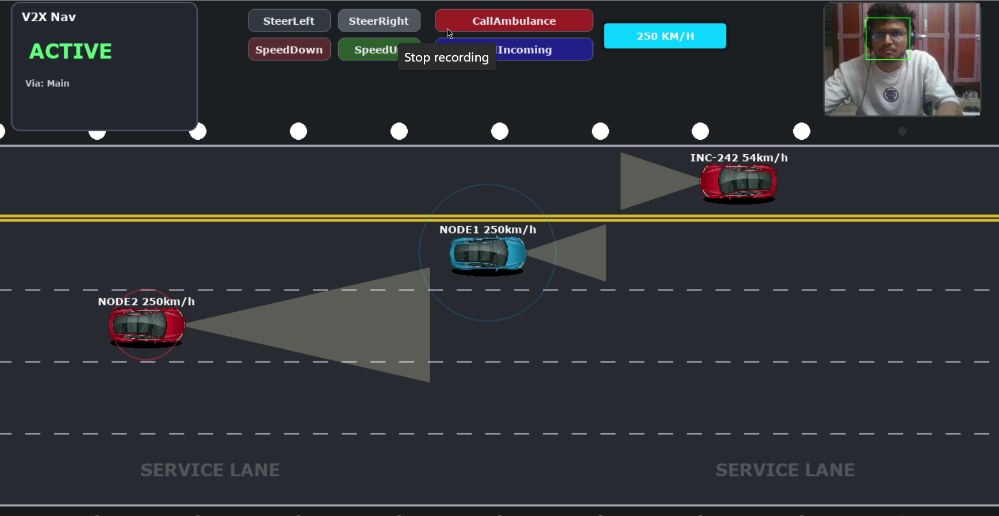

# 🚗⚡ V2X Smart Highway Simulation

### Real-Time Connected Vehicle Ecosystem using AI, MQTT & Computer Vision

<p align="center">

</p>

<p align="center">


</p>

---

# 🌍 Project Overview

This project simulates a **Vehicle-to-Everything (V2X) connected highway system** where vehicles communicate in real time to improve **road safety, traffic intelligence, and autonomous decision making**.

The simulation demonstrates how connected vehicles can:

• Share telemetry  
• Detect hazards  
• Prevent collisions  
• Cooperate with infrastructure  

The system integrates **network communication, computer vision, and intelligent vehicle behaviour** into one real-time simulation environment.

---
# 🎥 Project Demo

<p align="center">
  
  
  
</p>

<p align="center">
Adaptive Headlights • Emergency Vehicle Priority • AI Drowsiness Detection
</p>

---

# 🧠 Core Concept

V2X stands for:

| Type | Description |
|-----|-------------|
| V2V | Vehicle to Vehicle communication |
| V2I | Vehicle to Infrastructure communication |
| V2P | Vehicle to Pedestrian awareness |
| V2N | Vehicle to Network connectivity |

This simulation demonstrates **V2V + V2I cooperative safety systems**.

---

# 🚀 Key Features

## 🚗 Real-Time Multi Vehicle Simulation

Multiple vehicles can run on **different machines** and synchronize via MQTT.

Features include:

- Real-time telemetry broadcasting
- Vehicle position synchronization
- Collision avoidance logic
- Cooperative traffic flow

---

## 📡 V2X Network Communication

Vehicles exchange information using **MQTT protocol**.

Each vehicle publishes:

- position
- speed
- lane
- braking state
- emergency status
- headlight mode

This allows other vehicles to **react intelligently to traffic conditions**.

---

## 🧠 AI Safety System

The project integrates **Computer Vision based driver monitoring**.

Features:

- Real-time **drowsiness detection**
- Face detection using OpenCV
- Automatic **emergency stop**
- Auto redirect to **service lane**

This simulates how future vehicles may prevent accidents caused by driver fatigue.

---

## 🛣️ Intelligent Highway Infrastructure

The highway simulation contains:

• 5-lane road architecture  
• incoming traffic lane  
• forward traffic lanes  
• emergency service lane  

Smart infrastructure features:

- Dynamic streetlights
- Emergency lane routing
- collision alert system

---

## 🚑 Emergency Vehicle System

Users can spawn **ambulances** inside the simulation.

Emergency vehicles:

- override traffic priority
- influence nearby vehicles
- demonstrate cooperative traffic behavior

---

## 📊 Modern Interactive Dashboard

The simulation includes a real-time UI dashboard displaying:

- speed gauge
- vehicle status
- safety alerts
- navigation system
- camera feed for AI monitoring

---

# 🎮 Controls

| Control | Action |
|------|------|
| Steer Left | Change lane left |
| Steer Right | Change lane right |
| Speed Up | Increase vehicle speed |
| Speed Down | Reduce vehicle speed |
| X | Simulate drowsiness |
| Call Ambulance | Spawn emergency vehicle |
| Call Incoming | Spawn opposite traffic |

---

# ⚙️ System Architecture

```
Vehicle Node
     │
     │  MQTT Telemetry
     ▼
MQTT Broker
     │
     ▼
Other Vehicle Nodes
```

Each vehicle acts as a **distributed network node** broadcasting telemetry and reacting to other vehicles.

---

# 🛠️ Tech Stack

| Component | Technology |
|----------|-----------|
| Language | Python |
| Graphics | Pygame |
| Computer Vision | OpenCV |
| AI Processing | NumPy |
| Networking | MQTT |
| Protocol | EMQX Broker |

---

# 📦 Installation

Clone the repository

```
git clone https://github.com/YOUR_USERNAME/v2x-smart-highway.git
cd v2x-smart-highway
```

Install dependencies

```
pip install pygame opencv-python numpy paho-mqtt
```

Run the simulation

```
python v2x_unified_complete.py
```

---

# 🧪 Running Multi-Vehicle Simulation

To simulate multiple vehicles:

Run the program on **multiple systems**.

Each system should enter a different **Vehicle ID**.

Example:

```
CAR1
CAR2
CAR3
AMB1
```

All vehicles will automatically synchronize through the MQTT broker.

---

# 🔬 Future Improvements

Possible future expansions:

• reinforcement learning traffic control  
• smart traffic signals  
• vehicle platooning  
• autonomous navigation  
• edge computing integration  
• real map integration  

---

# 👨‍💻 Author

**Atharva Gai**  
M.Tech CSE — VIT Vellore  

Specializing in:

• Intelligent Transportation Systems  
• Distributed Systems  
• AI powered safety systems  

GitHub: https://github.com/theatharvagai  

---

# ⭐ Support

If you find this project useful:

Give it a ⭐ on GitHub.
